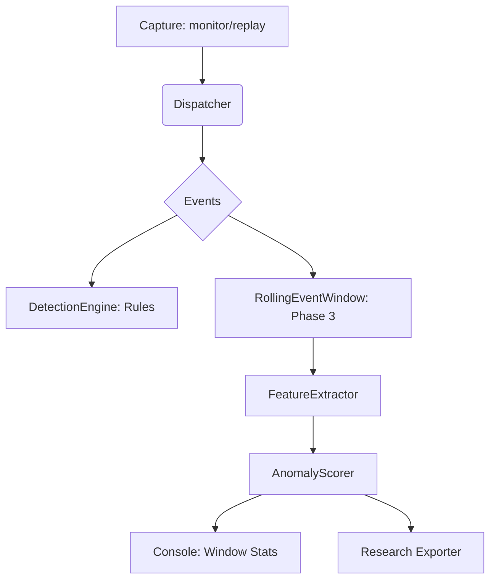

# AirSentry Phase 3 — Environment Analysis & Research Collection

Phase 3 transitions AirSentry from a basic rule-based IDS into a wireless research platform capable of high-level environment analysis and structured data collection.

## Key Accomplishments

### 1. Analysis Engine (`airsentry.analysis`)
- **Rolling Event Window**: Implemented a stateful aggregator that holds `FrameEvent` objects for a configurable look-back duration (default 60s).
- **Feature Extraction**: Stateless computation of 20+ wireless metrics (mac/ssid counts, frame rates, Shannon entropy, broadcast ratios).
- **Anomaly Scoring**: Hybrid system using `IsolationForest` (ML) with a heuristic cold-start fallback. Real-time scores are normalized to [0..1].

### 2. Research Data Collection (`airsentry.research`)
- **Structured Collector**: Orchestrates the capture → extraction → scoring pipeline for dedicated research sessions.
- **Privacy Layer**: Session-scoped MAC address anonymization using HMAC-SHA256 with a random salt.
- **Dataset Export**: Clean, research-quality export to `CSV` or `JSONL` formats with auto-generated filenames.

### 3. CLI Enhancements
- **New `collect` command**: Dedicated mode for timed research collection (e.g., `airsentry collect --duration 300 --location coffee_shop`).
- **Enhanced `monitor`/`replay`**: Added `--analyze` flag (on by default) to show real-time environment statistics panels and ML-driven anomaly alerts.

---

## Verification Results

### ✅ Smoke Tests Passed
- Data Extraction: Successfully computed counts and entropy from mock events.
- Anomaly Scoring: Verified heuristic behavior during warm-up phase.
- Privacy Anonymization: Confirmed deterministic, one-way MAC hashing.

### ✅ CLI Verification
- `airsentry collect --help`: Subcommand registered correctly.
- `airsentry monitor --no-analyze`: Original behavior preserved.

---

## Architecture Visual

